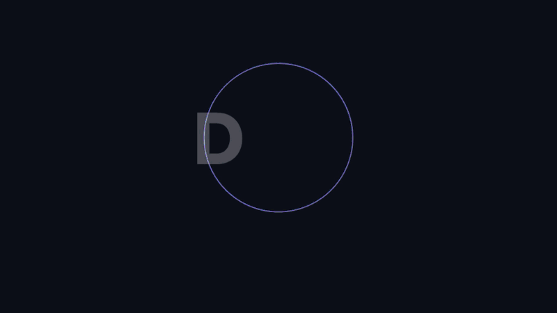
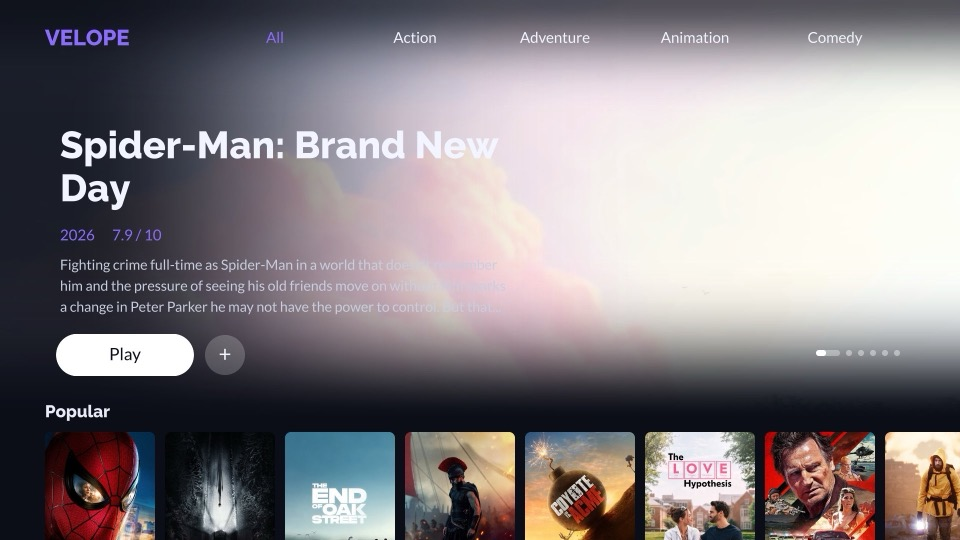
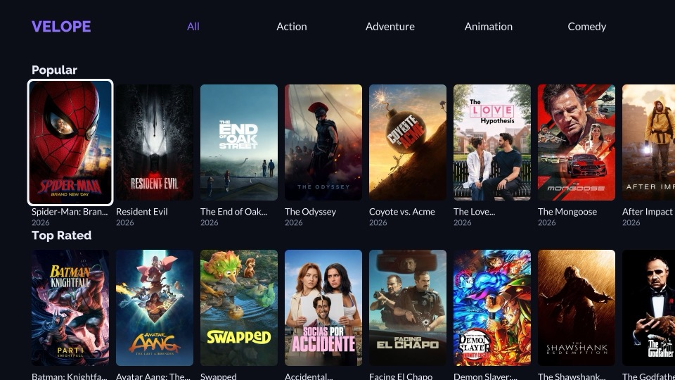
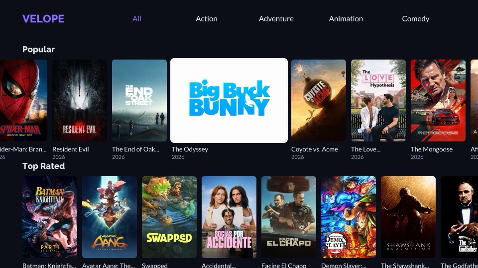
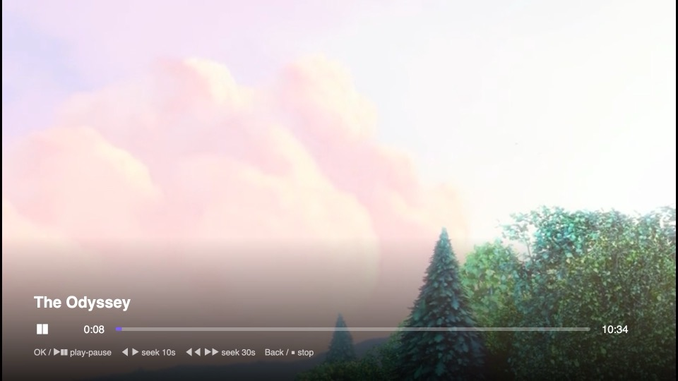
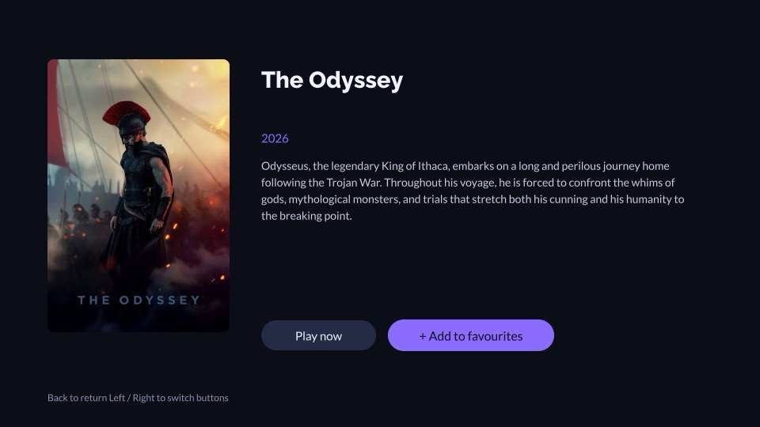
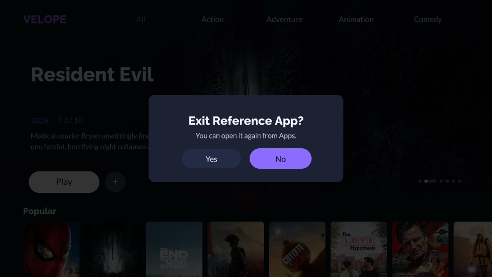

<h1 align="center">Reference App</h1>

<p align="center">A reference streaming app for <b>Samsung TVs</b> (Tizen), built for the Velope OTT developer test.<br>
SolidJS on the Lightning 3 WebGL renderer, packaged as a Tizen web app and driven entirely from the Samsung remote.</p>

<p align="center">
  
  
  
  
</p>

<p align="center"></p>
<p align="center"><sub>The app running in Chrome at 1920 × 1080: splash, hero preview, rows, a tile preview growing into the player, details, exit dialog.<br>Full quality: <a href="docs/media/demo-1080p.mp4">1080p MP4</a> (7 MB).</sub></p>

## Contents

- [What it is](#what-it-is)
- [Screens](#screens)
- [Features](#features)
- [Before you build: two things you must supply](#before-you-build-two-things-you-must-supply)
- [Build, install and run on the TV](#build-install-and-run-on-the-tv)
- [Run in a desktop browser](#run-in-a-desktop-browser)
- [Controls](#controls)
- [How the Samsung parts work](#how-the-samsung-parts-work)
- [Testing on the TV](#testing-on-the-tv)
- [Performance notes](#performance-notes)
- [Known limitations](#known-limitations)
- [Project layout](#project-layout)
- [Dependencies](#dependencies)
- [Credits](#credits)

## What it is

A genre menu, a hero banner with video previews, 12 endlessly looping rows of titles from The
Movie Database, a details page, a full-screen player with its own on-screen controls and an exit
dialog, all driven from the Samsung remote and tested on a real TV (Samsung UE43U7020, Tizen 10).

The pages and components started life in a sibling project (`Velope-OTT-Reference-App-SolidTV`);
everything here has since been made Samsung-specific and this repository stands on its own.

The full user flow (every screen and where each remote button leads) is in
[`docs/user-flow.html`](docs/user-flow.html) (also available as a shared page, access on request).

## Screens

| | |
| --- | --- |
|  |  |
| **Hero banner.** Six featured titles; the preview plays behind the text with sound, the page dot fills over 15 s. | **Rows.** 12 looping rows; focus walks to the middle tile, then the row slides. |
|  |  |
| **Tile preview.** Rest 3 s and the tile widens and plays; OK after 7 s grows it into the player. | **Player.** Controls, seek badge (+10s, +20s…), 1080p adaptive streaming. |
|  |  |
| **Details.** Poster, synopsis, Play now, favourites. | **Exit dialog.** Exit key anywhere, or Back at the top; No is preselected. |

## Features

- **Splash.** A DOM overlay (`src/splash.ts`) from boot until the first rows are ready: the DMP
  monogram drops in over a pulsing ring, then a bar and the tagline. Its chime is synthesised
  with Web Audio, so no audio file ships. It stays at least 2.8 s. Samsung's own loading dots
  before it are the OS's.
- **Genre menu** (`GenreNav.tsx`): All plus the first four TMDB genres. OK reloads the hero and
  every row for that genre; focus stays in the menu.
- **Hero banner** (`HeroBanner.tsx`, cycle in `Home.tsx`): the first six titles with wide artwork
  from the genre's first row, each with backdrop, title, year and rating, synopsis, **Play** and
  a **+** button, and page dots. One second after an item shows (and once the splash has faded),
  its preview plays full screen behind the see-through canvas, with sound, and the artwork fades
  out; the active dot stretches into a pill that fills over 15 s. Every item starts its own
  preview from the beginning (one test asset stands in for six trailers). When the preview ends
  the item stays; the next item comes in only once the remote has been idle for 7 s, looping
  after the sixth. Left/Right move between Play and +; Right from + is the next item, Left from
  Play the previous. Down moves to the rows (the hero slides away and its video stops), Up
  returns; Back from the rows returns to the hero. Play opens the full-screen player and, when
  the preview is running, continues it seamlessly: the player adopts the preview's video element
  and streaming engine (`handOver` in `host.ts`). + turns into a drawn tick (`Tick.tsx`).
- **Rows** (`CarouselRow.tsx`, `MovieTile.tsx`): 12 rows of 20 titles per genre (Popular, Top
  Rated, New Releases, …), each a single TMDB discover page. Moving right, focus walks across the
  screen to the middle tile (the 4th of 7), then stays there while the row slides and cycles
  forever; moving left, focus walks back to the left edge before the row slides back down to the
  real first item (`stepColumn` in `Home.tsx`). Up/Down land on the tile directly above or below
  on screen; each row keeps its own scroll. Only tiles in or near the viewport exist.
- **Tile preview.** Resting 3 s on a tile widens it to about twice its width (black until the
  video starts) and plays the preview over it with sound, capped at 480p, with a progress bar
  along the bottom. In the middle slot the tile grows to both sides and its neighbours move
  apart. OK before the preview has played 7 s opens the details page; OK at 7 s or later grows
  the preview from the tile into the full player (0.4 s, a GPU transform) and carries on from the
  same second, lifting the 480p cap. Back from that player opens the title's details page. Any
  other focus change stops the preview.
- **Details page** (`Details.tsx`): poster, title, year, synopsis, **Play now** and
  **+ Add to favourites** (a label toggle). Rendered from the data the row already has; no
  second API call. Back returns to the rows with focus and scroll intact (Home is kept alive).
- **Player.** Title, play/pause state, progress bar, elapsed and total time, a buffering
  indicator and a key legend, drawn as DOM over the video. They fade out 4 s after the last key
  while playing and stay up while paused. Every seek shows a centre badge with the running total.
  Back, Stop or the end of the video closes it and returns to where it was opened from.
- **Exit dialog** (`ExitDialog.tsx`): "Exit Reference App?" with focus on No. Left/Right choose,
  OK confirms, Back cancels and returns focus to where it was.
- **Dormant.** After 10 minutes without a key press the previews stop (artwork stays); any key
  wakes the app.
- **Error screen.** If genres or the first rows cannot load, a message and a Retry button
  (Enter) instead of the home page.

### What plays

Every preview and every Play is **Big Buck Bunny** (clear HLS from Mux's public test streams;
Blender Foundation, CC BY 3.0) through hls.js: the TV's native HLS player stayed on the lowest
variant (320×184, choppy audio) while hls.js reaches 1080p within seconds. Previews are capped
at 720p (hero) and 480p (tile); the full player is adaptive. `src/state/playback.ts` also
describes a DASH + Widevine stream and the player has the Shaka path for it, but it is not in
the list that Play tries: see Known limitations.

## Before you build: two things you must supply

The repository contains no secrets. To build and run the app you need both of these, and
neither is in the repo:

1. **A TMDB API key** (free). The app reads its catalogue from The Movie Database. Register at
   https://developer.themoviedb.org/docs/getting-started, then:

   ```sh
   cp .env.example .env
   # edit .env and set VITE_TMDB_API_KEY=<your 32-character v3 key>
   ```

   Without it the app boots into its error screen saying exactly this. `.env` is git-ignored.
   The key is read by Vite at build time and ends up in the bundle, since the app calls TMDB
   directly; nothing is committed.

2. **A Samsung signing certificate that includes your TV.** Samsung TVs only install test apps
   signed with a certificate that lists the TV's own ID (its *DUID*). The certificate is not in the
   repo and cannot be shared with you; create your own in about 10 minutes:

   <details>
   <summary><b>Create the certificate</b> (about 10 minutes, step by step)</summary>

   1. Install the Tizen SDK (CLI installer from https://samsungtizenos.com/tools-download/; Tizen
      Studio is retired) plus the *Samsung Certificate Extension* and *Samsung Tizen TV SDK*
      packages: `~/tizen-sdk/package-manager/package-manager-cli.bin install --accept-license
      Certificate-Manager,cert-add-on,TV-SAMSUNG-Public-WebAppDevelopment`.
   2. Put the TV in Developer Mode: on the TV open **Apps**, type **1 2 3 4 5** on the remote,
      switch Developer Mode **On**, enter your computer's IP address, and restart the TV.
   3. Connect and read the TV's DUID:
      ```sh
      ~/tizen-sdk/tools/sdb connect <TV IP>
      ~/tizen-sdk/tools/sdb shell 0 getduid
      ```
   4. Open `~/tizen-sdk/tools/certificate-manager/certificate-manager.app`, press **+**, choose
      **Samsung → TV**, name the profile (say `MyTV`), create an author certificate, sign in with a
      Samsung account when asked, then create a distributor certificate and make sure the DUID
      from step 3 is in its device list. Finish.
   5. Build with your profile name: `TIZEN_PROFILE=MyTV TV_IP=<TV IP> pnpm tizen`.

   </details>

   Already have a signed `ReferenceApp.wgt` from someone whose certificate lists your TV? Then you
   only need steps 1–3 and `~/tizen-sdk/tools/ide/bin/tizen install -n ReferenceApp.wgt -s <TV IP>:26101`.

## Build, install and run on the TV

Requires Node 20+, pnpm 10, the Tizen SDK, the TV in Developer Mode pointing at this computer's
IP, a TMDB key in `.env` and a Samsung signing profile whose distributor certificate includes the
TV's DUID (see above).

```sh
pnpm install
cp .env.example .env        # then add your TMDB key
pnpm tizen                  # build + package + install + launch on the TV
pnpm tizen:package          # build + package only: tizen-build/ReferenceApp.wgt
```

`scripts/tizen.sh` reads three environment variables. The defaults are the original author's test
setup and will not match yours, so set them:

| Variable | Default | Meaning |
| --- | --- | --- |
| `TV_IP` | `192.168.1.216` | The TV's address on your network |
| `TIZEN_PROFILE` | `Ellery` | The signing profile name from Certificate Manager (the default does not exist on your machine) |
| `TIZEN_SDK` | `~/tizen-sdk` | Where the Tizen SDK is installed |

The script runs `pnpm build`, copies `dist/` plus `tizen/config.xml` and `tizen/icon.png` to
`tizen-build/`, signs and packages it as `ReferenceApp.wgt`, then installs and launches it over
`sdb`. The app's internal id is `VelSamsung.VelopeTV` (kept from the first build so updates
replace the installed app rather than adding a second one); the TV shows it as "Reference App".

On macOS, `sdb` is a background process that the Local Network privacy setting can silently
block. If the TV answers but `sdb connect` fails, start sdb once from the Terminal app.

## Run in a desktop browser

The same bundle runs in desktop Chrome for layout and logic work; nothing Tizen-specific is
needed (the Tizen APIs are simply absent, so Exit logs a line instead of closing anything).

```sh
pnpm install
cp .env.example .env        # then add your TMDB key
pnpm dev                    # Vite dev server on http://localhost:5173
pnpm build                  # production bundle in dist/
pnpm preview                # serve dist/ on http://localhost:4173
pnpm typecheck              # strict tsc over src/
```

To see the TV layout, use Chrome DevTools device mode with a custom device of
**1920 × 1080 at device pixel ratio 1**, and **reload after switching to it**: the app fits its
1920 × 1080 scene to the window size it finds at start-up, so a window resized afterwards shows a
scene sized for the old window. Append `?fps=1` to show the FPS counter (top right). Chrome's
autoplay policy may mute the splash chime and the preview sound until you have clicked the page;
the TV has no such rule.

A rough performance check is possible here (DevTools → Performance → CPU: 6× slowdown, then hold
Arrow Right through a row's seam and Arrow Down through all 12 rows, watching the FPS counter and
the focus ring), but a desktop browser says little about a TV's GPU or decoder: measure on the TV
itself (see Testing on the TV).

## Controls

| Samsung remote | Keyboard (dev) | Action |
| --- | --- | --- |
| Up / Down | Arrow Up / Down | Move between the genre menu, the hero banner and the rows |
| Left / Right | Arrow Left / Right | Move within a row, the hero or the menu |
| OK | Enter | Open a title / choose a genre / press a button |
| Back | Escape / Backspace | Rows → hero; hero or menu → exit dialog; details → rows with state intact |
| Exit | | Exit dialog, from anywhere (closes the player first) |

In the player:

| Samsung remote | Keyboard (dev) | Action |
| --- | --- | --- |
| OK or Play/Pause | Enter | Play / pause (controls stay up while paused) |
| Play, Pause | | Play, pause |
| Left / Right | Arrow Left / Right | Seek 10 s; a centre badge shows the total (repeat presses add up: +10s, +20s…) |
| Rewind / Fast-forward | | Seek 30 s, with the same badge |
| Back or Stop | Escape / Backspace | Close the player |

## How the Samsung parts work

All of it lives in `src/host.ts` (plus `tizen/` and `scripts/tizen.sh`):

- **Remote keys.** Samsung's Back key is keyCode 10009 (added to the focus manager's Back list in
  `src/index.tsx`). The media keys (play/pause, play, pause, stop, fast-forward, rewind) and the
  Exit key are only delivered to apps that register them, so the host registers them through
  `tizen.tvinputdevice` at start-up.
- **Player.** A `<video>` element over the WebGL canvas with its own DOM controls; while it is up
  it owns the remote (see Controls).
- **Previews.** Two more `<video>` elements: one placed over an expanded tile, one full screen
  behind the see-through canvas for the hero banner. Both stream through hls.js with a quality cap.
- **Exit.** The Exit key, or Back at the top of the app, opens a Yes/No dialog; Yes calls
  `tizen.application.getCurrentApplication().exit()`.
- **Packaging.** Vite builds with relative asset URLs (`base: './'`) because the packaged app loads
  from the TV's filesystem. `tizen/config.xml` declares the app, its 1080p screen feature and its
  privileges (internet, TV input device, DRM playback).

## Testing on the TV

- **Remote logging.** The TV has no readable console. Build with
  `VITE_LOG_URL=http://<this computer's IP>:9999 pnpm tizen` and run any HTTP listener on that
  port: the app POSTs every console line, key press (`KEY`), focus change (`FOCUS`), details state
  (`DETAILS`), video event (`VIDEO`), the 5 s `METRICS` line and a playback probe every 2 s
  (`PROGRESS`: media vs wall time, buffer, resolution). Without the variable none of it is built in.
- **Driving the remote.** Samsung TVs accept remote keys over
  `wss://<TV>:8002/api/v2/channels/samsung.remote.control` (`ms.remote.control`, e.g. `KEY_UP`,
  `KEY_ENTER`, `KEY_RETURN`, `KEY_PLAY`, `KEY_PAUSE`, `KEY_PLAY_BACK`, `KEY_FF`, `KEY_REWIND`,
  `KEY_STOP`), which is how the build was tested end to end.
- **Fault injection.** `tools/tmdb-mock.server.mjs` is a TMDB stand-in: it proxies the real API
  and lets you flip failures, delays, short rows and exhaustion at runtime (see its header).
  Point the app at it with `VITE_TMDB_BASE_URL=http://localhost:8787` in `.env`.
- **Dev hooks.** A dev build (`pnpm dev`) exposes `__velope` in the console with the page state
  and a renderer node count (`__velope.countNodes()`); production bundles carry none of it.

## Performance notes

Measured on a Samsung UE43U7020 (Tizen 10).

- With `VITE_LOG_URL` set, the app logs a `METRICS` line every 5 s (JS heap, DOM/video/canvas
  counts, renderer nodes, fps, main-thread long tasks), which is how the numbers below were taken.
- Rows: 60 fps, no long tasks. Memory is flat (no leaks were found in a code audit of every
  create/destroy pair).
- Hero item changes went from 5–10 s at 37–48 fps with 300–760 ms freezes to about 5 s at
  45–53 fps with nothing above 250 ms, by: w1280 artwork instead of TMDB's `original` (up to 4K,
  which blew the renderer's 160 MB texture budget after one rotation), preloaded for the
  neighbours; the preview starting straight at its 720p cap instead of ramping up; and the
  page-pill ticker at 300 ms instead of 100 ms (each tick redraws the whole scene over the
  composited video). The remaining cost is the TV starting a new stream, which one preview per
  title requires.
- The tile-to-player grow is a transform (the box takes its full-screen size at once and is
  scaled from the tile): about 60 fps on the TV, where animating width and height gave 4 frames
  with a 233 ms freeze.
- Every hls.js instance sets `backBufferLength: 30` so played-back video is released from memory.
- The see-through canvas costs one full-screen blend per composited frame; it is inherent to
  drawing the hero over a video and is left as is.

## Known limitations

- **No DRM playback yet.** The player can take a DASH + Widevine stream through Shaka Player and
  EME, but the only licence server available (castLabs DRMtoday staging) refuses the TV's requests
  (Shaka error 6007), so Play only tries the clear stream. It needs a licence server that accepts
  the TV.
- **Favourites are not persisted.** The hero's + and the details page's button only remember
  their state until the app closes, and they do not share a list. (A saved list was built and
  reverted; see the git history.)
- **One test asset.** Every hero preview, tile preview and Play uses the same Big Buck Bunny
  stream; there are no per-title trailers.
- **Missing glyphs.** The MSDF font atlases lack ★ · ▶ ✓ and the em dash (TMDB uses it in
  synopses, where it renders as `?`). The rating line is plain text and the tick is drawn from
  two bars for that reason.
- The player controls and previews are DOM elements over or under the canvas, not Lightning
  nodes, so they are styled in CSS.

## Project layout

```
index.html                    Page shell: dark body, canvas above the hero video
vite.config.ts                Relative base, env injection, renderer build flags
src/
  index.tsx                   Boot: remote logging, splash, renderer options, fonts, focus manager (Back 10009), metrics probe
  host.ts                     Samsung host: key registration, player with controls, tile and hero previews, exit
  host.types.ts               The host interfaces (AppHost, AppPlayer, AppPreview, AppHeroPreview)
  splash.ts                   DOM splash overlay and synthesised chime
  debug.ts                    Dev-only hooks (__velope: state, node count)
  fonts.ts                    The two MSDF fonts and their metrics
  theme.ts                    Palette (0xRRGGBBAA) and layout constants (tile sizes, timings)
  env.d.ts                    Types for the VITE_* variables
  App.tsx                     HashRouter: Home (kept alive) and Details, exit dialog on top
  pages/Home.tsx              The focus engine: menu, hero cycle, rows, previews, dormancy, all key input
  pages/Details.tsx           Poster, metadata, Play now, favourites toggle, back handling
  components/HeroBanner.tsx   Artwork, gradients, title block, Play and + buttons, page dots
  components/CarouselRow.tsx  Virtualised, cycling row of tiles
  components/MovieTile.tsx    Poster tile with focus ring and expanded (preview) state
  components/Tick.tsx         A check mark drawn from two bars
  components/ExitDialog.tsx   Modal Yes/No that takes and returns focus
  components/GenreNav.tsx     Wordmark and genre pills
  components/ActionButton.tsx Details/exit button
  components/ErrorScreen.tsx  Message and Retry
  state/boot.ts               The splash handle and the "splash hidden" signal
  state/exit.ts               Whether the exit dialog is open
  state/playback.ts           The streams (Big Buck Bunny; Widevine kept for reference)
  state/selection.ts          The title handed from Home to Details
  services/tmdb.ts            TMDB access: XHR JSON with timeout and abort, response cache, image sizing
  services/rows.ts            The 12 row collections, one 20-title page per row
public/fonts/                 Lato and Raleway MSDF atlases and TTFs
tizen/config.xml, icon.png    Samsung app manifest (id VelSamsung.VelopeTV, privileges) and icon
scripts/tizen.sh              Build, package (signed .wgt), install and launch on the TV
docs/user-flow.html           Every screen and every remote button
tools/tmdb-mock.server.mjs    Fault-injection proxy for TMDB
```

`NOTES.md` lists the Tizen and Lightning pitfalls met while building this app.

## Dependencies

- `@solidtv/solid` 1.6.3 and `@solidtv/renderer` 1.9.3: SolidJS bindings over the Lightning 3
  WebGL renderer (`solid-js`; `@solidjs/router` for the hash router it wraps).
- `hls.js` and `shaka-player`, both loaded on demand with a dynamic import: hls.js for every
  HLS stream (previews and the player), Shaka only for DASH/DRM.
- `vite` and `vite-plugin-solid` (dev): the build; `typescript` (dev): strict checks.

Fonts (Lato, Raleway) ship as pre-generated MSDF atlases in `public/fonts`, plus the TTFs the
splash uses; no font tooling runs at build time.

## Credits

- This product uses the TMDB API but is not endorsed or certified by TMDB.
- Big Buck Bunny © Blender Foundation, CC BY 3.0, streamed from Mux's public test streams.
- Lightning 3 renderer and SolidTV (`@solidtv/solid`, `@solidtv/renderer`), Apache 2.0.
- hls.js and Shaka Player, Apache 2.0.
- Fonts: Lato and Raleway, both under the SIL Open Font License.

The app's own code is under the MIT licence (see `LICENSE`).
